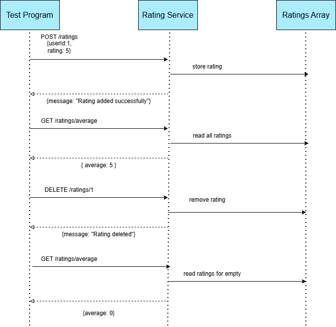

## Rating Microservice
## Description
This Rating Microservice allows users to submit, retrieve, and delete user ratings. It has functionality to calculate average ratings.  The service communicates using HTTP requests where it returns the data in a JSON format.

## How to Request Data
Programs can request data by sending REST API calls over HTTP.

## Example Request using fetch(Add a Rating)
Add a Rating
Endpoint: POST /ratings
```js
await fetch("http://localhost:3000/ratings", {
  method: "POST",
  headers: { "Content-Type": "application/json" },
  body: JSON.stringify({ userId: 1, rating: 5 })
});
```
## Example Request using fetch(Get Average Rating)
Get Average Rating
Endpoint: GET /ratings/average
```js
await fetch("http://localhost:3000/ratings/average");
```
## Example Request using fetch(Delete a Rating)
Delete a Rating
Endpoint: DELETE /ratings/:userId
```js
await fetch("http://localhost:3000/ratings/1", {
  method: "DELETE"
});
```
## How to Receive Data
The microservice returns JSON data.

## Example Response Handling
```js
const response = await fetch("http://localhost:3000/ratings/average");
const data = await response.json();

console.log(data.average);
```
## Example JSON Response:

Adding a Rating:
```json
{
  "message": "Rating added successfully"
}
```
Average Rating:
```json
{
  "average": 4.5
}
```
Delete a Rating:
```json
{
  "message": "Rating deleted"
}
```
## UML Sequence Diagram


